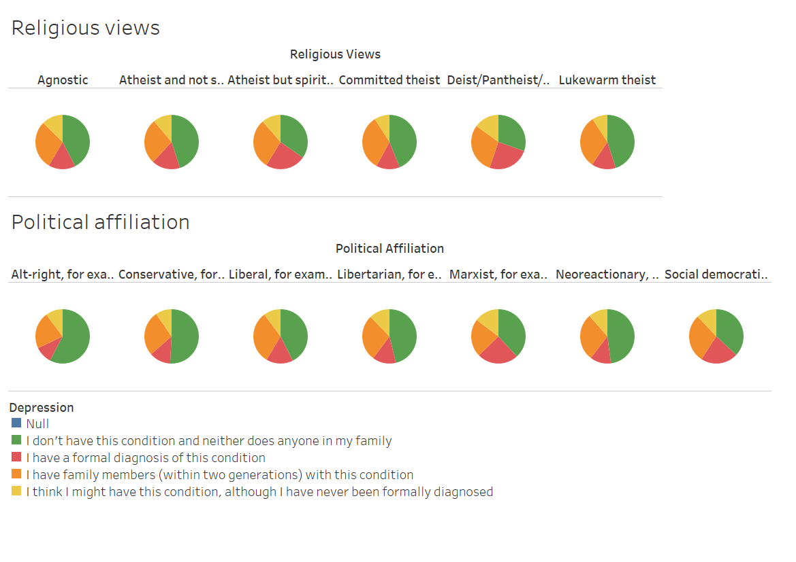
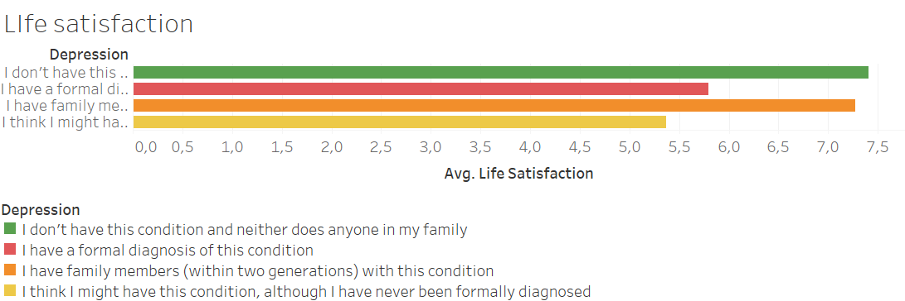
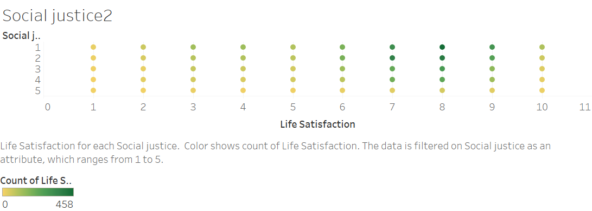
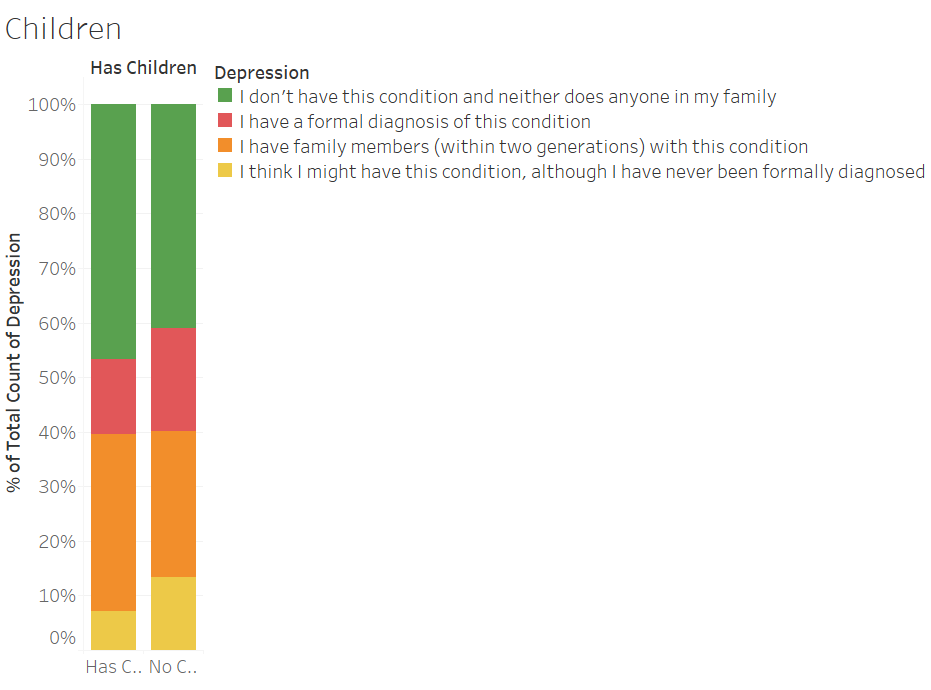
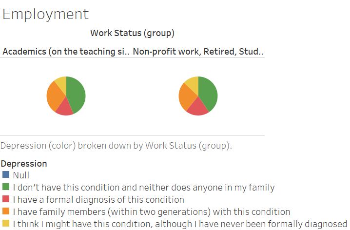
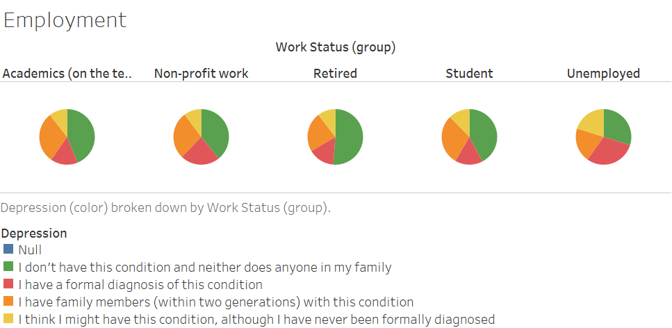

# Данные опроса Astral Codex Ten

В апреле 2024 года блог [Astral Codex Ten](astralcodexten.com) провёл опрос подписчиков на множество разных тем.
Результаты опроса были опубликованы, их можно [скачать](https://www.astralcodexten.com/p/acx-survey-results-2024) в виде .xslx файла.
Используя данные из этого файла и Tableau, ниже я попытаюсь найти признаки, с которыми наиболее хорошо коррелирует депрессия.

Большинство подписчиков блога - американцы. 
Кажется, что в США человека сильно характеризуют его религиозная и политическая принадлежности. 
Поэтому я начал с того, чтобы понять, есть ли зависимость депрессии и религиозности, а также есть ли зависимость депрессии и политических взглядов человека.

Мы видим, что как атеисты, так и верующие не склонны к депрессии. 
Она более заметна у тех, кто находится между этими крайними категориями: у атеистов, которые верят в духовное и у теистов/пантеистов, не относящих себя явно к конфессии.

Зато эта корреляция есть в политических взглядах: люди консервативных взглядов менее склонны к депрессии, чем люди марксистских и социал-демократических взглядов.
Это заставляет подумать о том, будет ли коррелировать с депрессией взгляды читателя на важность установления социальной справедливости в обществе. 

Здесь заметна некоторая зависимость, хотя она и кажется слабой в масштабах всего диапазона возможных значений.
Однако в данных есть пункт об удовлетворённости жизнью. Можно предположить, что он должен коррелировать с депрессией некторым образом.

Это действительно так! 
Тогда можно посмотреть его связь с взглядами тех, кого волнуют социальные проблемы.

Увы, шкала здесь крупная, потому здесь тоже не удастся получить более ясные выводы.

Можно попробовать посмотреть с другой стороны.
Консервативные люди, как правило, чаще занимаются семьёй и детьми.
Посмотрим на то, будет ли наличие детей коррелировать с падением депрессии:

Такая зависимость есть.
Кажется, разумным предположить, что люди, имеющие детей, где-то работают.
Возможно, что наличие работы оказывает влияние на психику.
Попробуем понять, связана ли депрессия с наличием оплачиваемой работы.
Заметим, что прямой связи нет:

Присмотримся ближе к тем, кто не имеет работы.
Хуже всего приходится именно тем, кто желает её получить, но не может.

Таким образом, депрессия коррелирует с марксистскимим и социально-демократическими политическими воззрениями, отсутствием детей и работы и плохо коррелирует с религиозностью.
Если более точно замерять восприимчивость людей к социальным проблемам, можно будет определить связь восприимчивости с депрессией.

Скачать файл Tableau с диаграммами можно в этом же репозитории: это [ACX2024.twb](https://github.com/zyavgarov/depression_causes/ACX2024.twb).